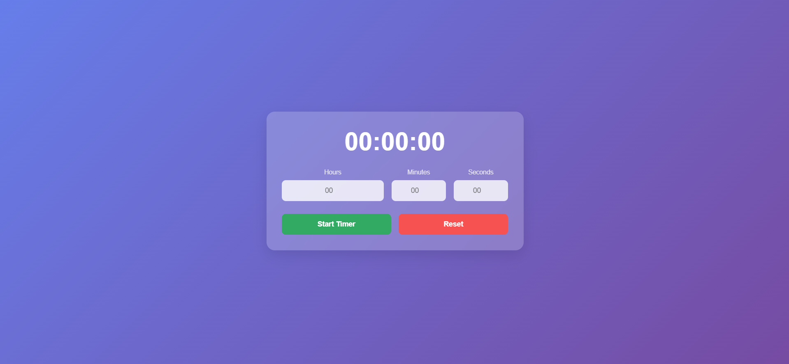

# Countdown Timer

A simple countdown timer built using **HTML, CSS, and Vanilla JavaScript**.

## Features

- Set a custom countdown time.
- Start and reset the timer.
- Displays time in HH:MM:SS format.
- Basic user-friendly UI.

## How to Use

1. Enter the countdown time in hours, minutes, and seconds.
2. Click the **Start** button to begin the countdown.
3. Click **Reset** to stop and reset the timer.

## Technologies Used

- **HTML** for structure
- **CSS** for styling
- **JavaScript** for countdown logic

## Installation & Setup

1. Clone the repository:
   ```sh
   git clone https://github.com/yourusername/countdown-timer.git
   ```
2. Open `index.html` in your browser.

## Preview



## Future Improvements

- Add alarm sound when the countdown reaches zero.
- Improve UI with animations.

## License

This project is open-source and free to use.

---

Made with ❤️ by Jogeshwar
