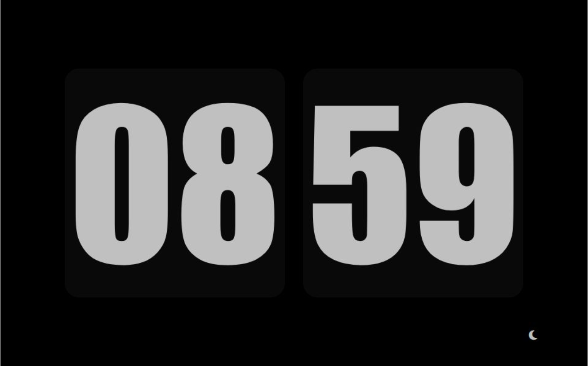

# Digital Clock

[Live Demo](https://jsdigitalclock.vercel.app/)

A simple and elegant digital clock built using [HTML, CSS, JavaScript].

## Features

- Displays current time in a 24-hour format
- Minimalist design
- Real-time updates

## How to Run

1. Clone this repository.
2. Open `index.html` in a web browser.

## Preview

