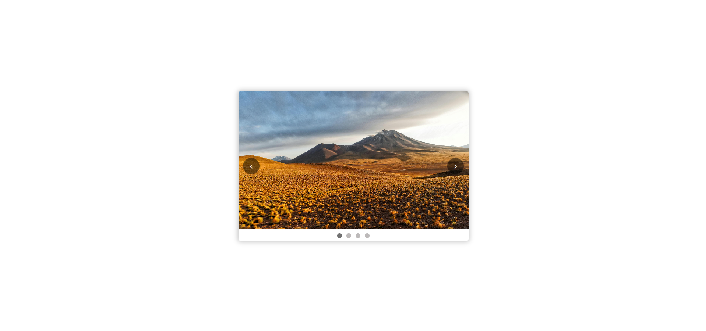

# Image Slider

## 🚀 Project Overview

An **Image Slider** built with vanilla JavaScript, HTML, and CSS. This project allows users to navigate through images using next/prev buttons.

## 🎯 Features

- ⏭️ Next and Previous buttons for manual navigation
- 🔢 Indicators for current image position

## 🛠️ Technologies Used

- HTML5
- CSS3 (Flexbox & Animations)
- JavaScript (ES6+)

## 📜 How to Use

1. **Clone the repository**
   ```sh
   git clone https://github.com/yourusername/image-slider.git
   ```
2. **Open `index.html` in a browser**

## 🎨 Customization

- Modify the `images/` folder to add your own images.
- Edit `style.css` for custom styles and animations.

## 🖼️ Demo Preview



## 📝 License

This project is **open-source** and available under the MIT License.
