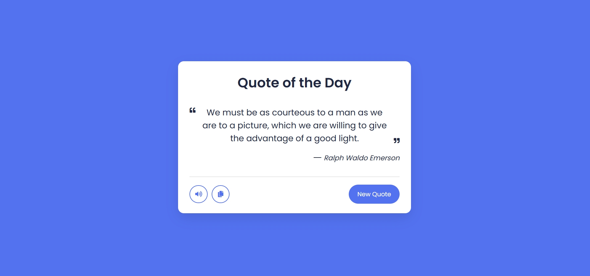

# Random Quote Generator

A simple JavaScript-based project that displays a random quote each time the user clicks a button. The quotes are dynamically generated from an array or fetched from an API.

## Features

- Displays a new random quote on button click
- Option to fetch quotes from a local array or an external API
- Clean and responsive UI
- Copy quote to clipboard functionality (optional)

## Technologies Used

- HTML
- CSS
- JavaScript (Vanilla)

## Preview

